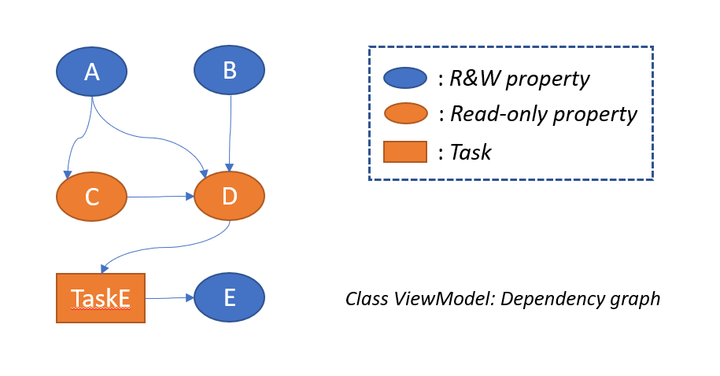

# Dependency-aware AutoNotify

## Examples

### AutoNotify within view model


```csharp
// original class
public partial class ViewModel : IObservableModel
{
    // auto notify
    // will generate property A in its partial class.
    [AutoNotify]
    private string a;

    private string b;

    [AutoNotify]
    public string e;

    // manually notify
    public string B
    {
        get => this.b;
        set
        {
            this.b = value;
            this.NotifyPropertyChange();
        }
    }

    [DependOn(nameof(A))]
    public string C
    {
        get => "Call from C:" + this.A;
    }

    [DependOn(nameof(A))]
    [DependOn(nameof(B))]
    [DependOn(nameof(C))]
    public string D
    {
        get => "Call from D:" + this.A + this.B + this.C;
    }

    // some time consuming task
    [DependOn(nameof(D))]
    public async Task TaskE()
    {
        await Task.Delay(5000);
        this.E = this.D + "E";
    }
}

// generated class
public partial class ViewModel
{
    // code for helper class

    public string A
    {
        get => this.a;
        set
        {
            this.a = value;
            this.NotifyPropertyChange();
        }
    }

    public string E
    {
        get => this.e;
        set
        {
            this.e = value;
            this.NotifyPropertyChange();
        }
    }
}

```